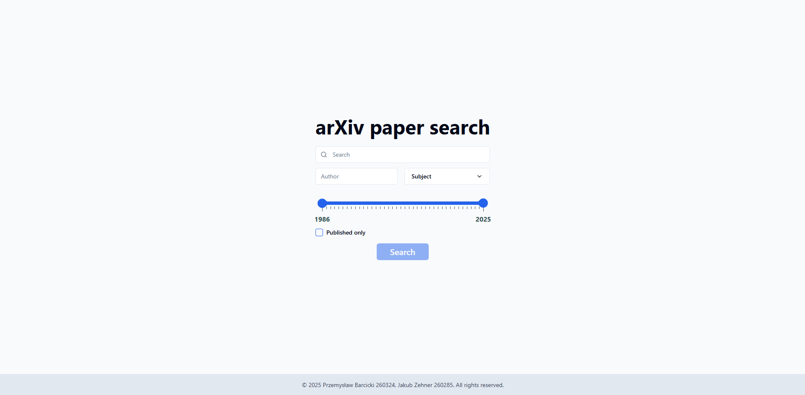
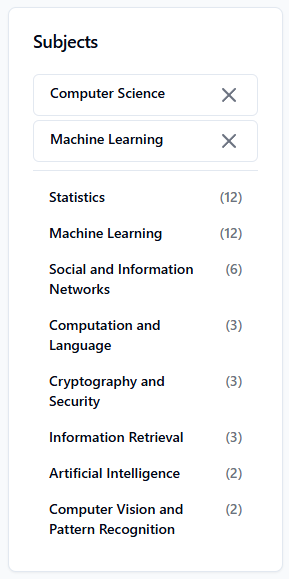

# ArXiv Search 🎓 (Information Retrieval System)

"Arxiv Search" is a system designed to retrieve scientific papers from the open-access repository arXiv. It allows users to search publications by keywords in titles and abstracts, as well as filter results by categories, publication dates, or authors. The system uses Elasticsearch to provide advanced features like full-text search, faceted filtering, and trend analysis. Its goal is to help researchers, students, and specialists efficiently discover relevant scientific works and analyze publication trends across disciplines. This application was developed using Elasticsearch, TypeScript, Svelte, Python, FastAPI, and PostgreSQL as part of the Information Retrieval Systems course at the Wrocław University of Science and Technology.

<table align="center">
  <thead>
    <tr>
      <th colspan="2">ArXiv Search Team</th>
    </tr>
  </thead>
  <tbody>
    <tr>
      <td align="center">
         
        <b>Przemysław Barcicki</b> 
        <a href="https://github.com/mlodybercik">@mlodybercik</a>
      </td>
      <td align="center">
         
        <b>Jakub Zehner</b> 
        <a href="https://github.com/jakubzehner">@jakubzehner</a>
      </td>
    </tr>
  </tbody>
</table>

## Screenshots 📸

Main page

Search page

Categories

Faceted navigation

Papers per year

## Diagrams 📝

Architecture diagram

Component diagram

## Benchmarks 📈

Ram usage

Indexing time

Retrieval times

